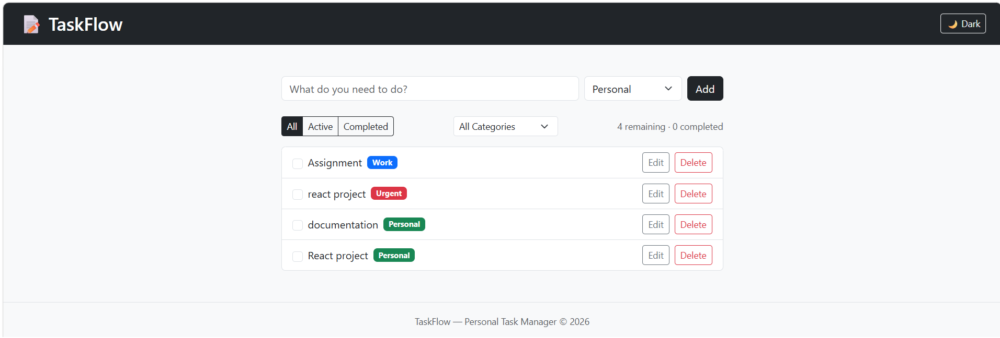
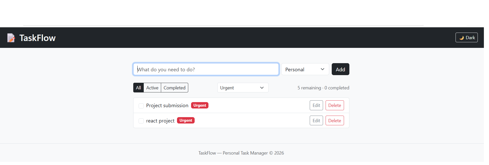
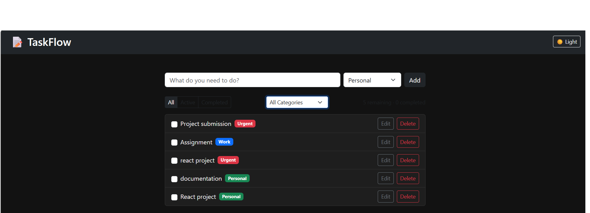

# TaskFlow — Personal Task Manager

TaskFlow is a React-based to-do app that helps you organize daily tasks by category, track progress with live counts, and keep your list even after refreshing the page. It goes beyond a basic to-do list by adding category tags, status filtering, and a dark/light theme toggle.

## Features

- Add, edit, delete, and mark tasks as complete
- Organize tasks into categories: Work, Personal, Urgent
- Filter tasks by status: All / Active / Completed
- Filter tasks by category
- Live count of remaining and completed tasks
- "Clear Completed" button to bulk-remove finished tasks
- Tasks persist across page refreshes using `localStorage`
- Dark / light theme toggle (also persisted)
- Confirmation dialogs for deleting a task and validation alert for empty input (via SweetAlert2)
- Responsive layout built with Bootstrap

## Technologies Used

- [React](https://react.dev/) (functional components + hooks: `useState`, `useEffect`)
- [Vite](https://vite.dev/) — build tool / dev server
- [React Router](https://reactrouter.com/) — routing setup
- [Bootstrap 5](https://getbootstrap.com/) — styling and responsive layout (via CDN)
- [SweetAlert2](https://sweetalert2.github.io/) — confirmation and alert dialogs
- Custom React hook (`useLocalStorage`) for persisting state to `localStorage`

## Project Structure

src/
├── Components/
│   ├── Header.jsx
│   ├── Footer.jsx
│   ├── TaskForm.jsx
│   ├── FilterBar.jsx
│   ├── TaskList.jsx
│   └── TaskItem.jsx
├── pages/
│   ├── Home.jsx
│   └── Layout.jsx
├── hooks/
│   └── useLocalStorage.js
├── assets/
│   └── Style.css
├── MyRoute.jsx
└── main.jsx

## Setup Instructions

1. Clone the repository and enter the project folder:
   
   git clone <your-repo-url>
   -cd To-Do-App
   
2. Install dependencies:
   
   -npm install
   
3. Run the app locally:
   
   -npm run dev
   
4. Open the local URL Vite prints in your terminal (usually `http://localhost:5173`).

## Screenshots

> Add 2–3 screenshots of the running app here before submitting, e.g.:
>
> 
> 
> 

## Known Limitations

- No drag-and-drop reordering of tasks
- No due dates or overdue indicators
- Categories are fixed (Work, Personal, Urgent) — not user-customizable